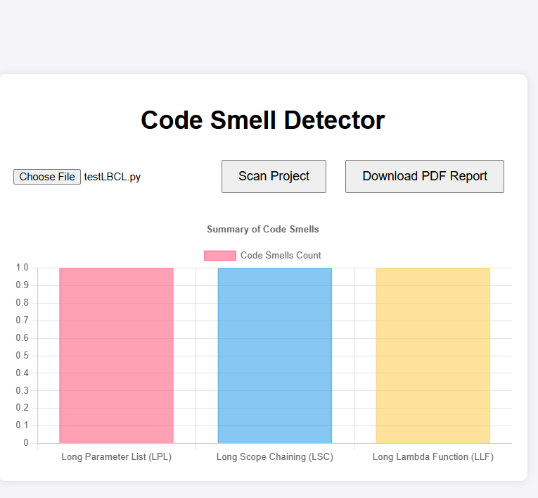
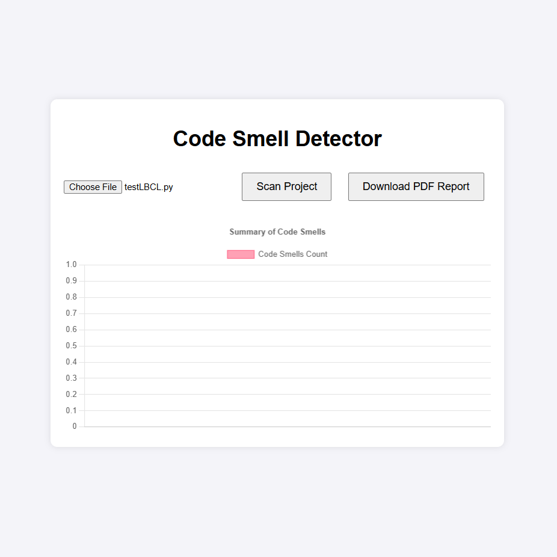
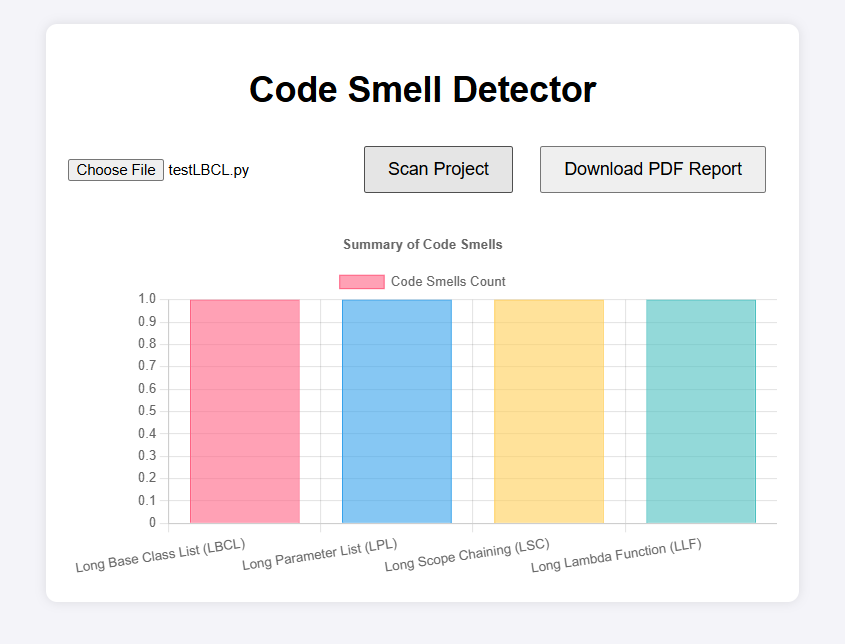
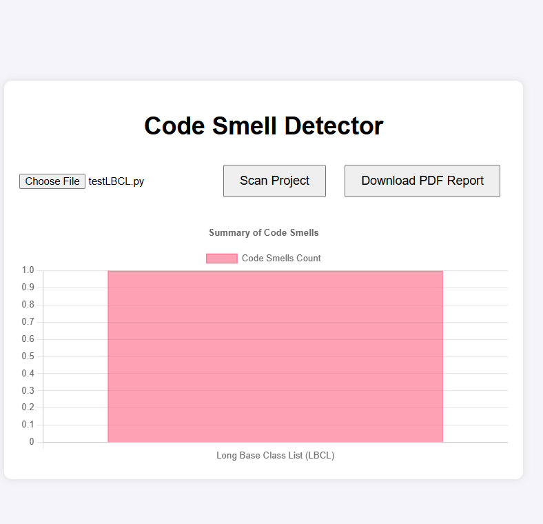

# Code Smell Detector

A Python-based tool for detecting code smells in uploaded Python files using static analysis techniques. This application helps developers identify bad coding practices and improve software maintainability.

## 🔍 Features

- Upload Python files for automated code smell detection
- Analyze Abstract Syntax Tree (AST) for pattern recognition
- Identify common smells such as long functions, large classes, nested conditionals, etc.
- Generate detailed JSON reports of detected smells
- Clean and interactive user interface for visualizing results

## Technologies Used

- **Backend:** Python, Flask
- **Code Analysis:** AST (Abstract Syntax Tree)
- **Visualization:** Chart.js, JSON Reports

## Screenshots

### 1. Interface

### 2. Code Analysis Result

